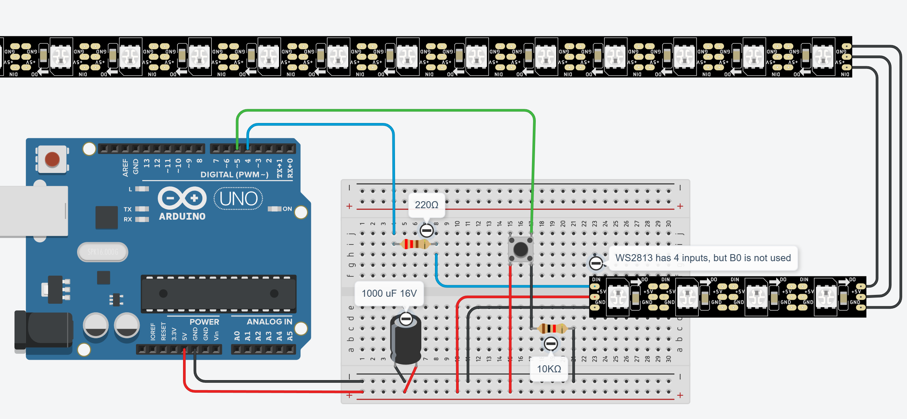

# aoc-arduino-stars

Display Advent of Code stars via an arduino and some led strips.

## Wiring diagram



## Dev environment

- Arduino
  - Board: ARDUINO-UNO-R4-WIFI
  - Led strip chip: WS2813B
  - Download Arduino IDE
  - Install libraries within Arduino IDE:
    - ArduinoHttpClient (0.6.1)
    - ArduinoJson (7.2.0)
    - FastLED (3.7.8)
    - NTPClient (3.2.1)
    - Time (1.6.1)

## Setup secrets

Create `src/star_display/arduino_secrets.h` with the following content:

```cpp
#include <avr/pgmspace.h>

// Required, wifi connection info
#define SECRET_SSID "YOUR WIFI NAME"
#define SECRET_PASS "YOUR WIFI PASSWORD"

// Optional, will fall back to DHCP if not provided
#define SECRET_ARDUINO_IP_ADDRESS "192.168.0.123" // Local IP address of the Arduino

// Optional, can be set on the web interface
const char SECRET_AOC_SESSION_KEY[] PROGMEM = "YOUR_SESSION_KEY"; // Your Advent of Code session key
#define SECRET_AOC_LEADERBOARD_ID "1234" // ID of the private leaderboard the app will query
#define SECRET_AOC_USER_ID "1234" // ID of the user the stars will be queried for
#define SECRET_LEADERBOARD_HOST "192.168.0.1" // Alternative IP address to get the leaderboard json from
#define SECRET_LEADERBOARD_PORT 5500 // Alternative port to get the leaderboard json from
```

## How it works

The arduino program queries <https://adventofcode.com> for the configured leaderboard to get the star completion state of the user then displays them it in a nice animated way. Since this is only done once every few hours, a tampermonkey script `notifier.js` is used on the client side to trigger a manual update on the arduino when a solution is completed. This ensures that new stars are displayed without delay.

To have an starry Xmas tree instead of a boring led strip, I cut the strip into smaller pieces and organized into a tree shape. I then soildered the leds together again and fastened it into a 3d printed tree from behind. I also mapped the id's of the individual leds to their real world position to create 2D animations.

## Advent of Code Automation

This repository does follow the automation guidelines on the /r/adventofcode [community wiki](https://www.reddit.com/r/adventofcode/wiki/faqs/automation). Specifically:

- Outbound calls are triggered manually or throttled to 1 per hour as defined in `AocClient.cpp`.  
  Furthermore, if it is impossible to get a data update (e.g. all stars are collected up to the current date), no automated requests will be made.
- All successful web request results and their timestamp are cached in EEPROM to prevent unnecessary reloads even after the arduino is reset.
- The User-Agent header in `AocClient.cpp` is set to me since I maintain this repository.
